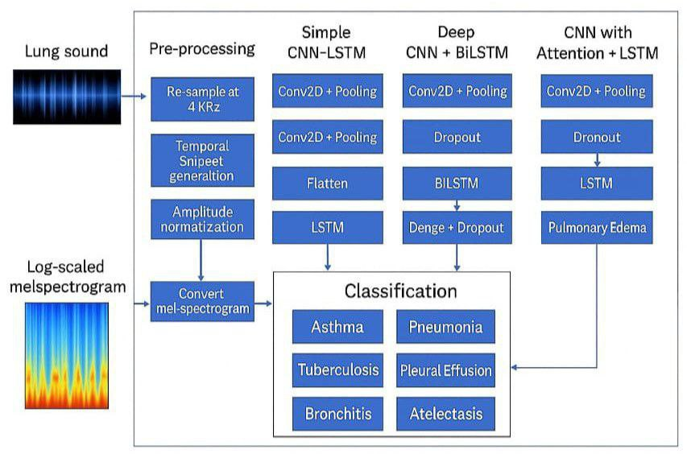

# Diagnosing Respiratory Conditions Via Lung Sounds using CNN-LSTM

## 👨‍🏫 Authors
- **Prof. Shah S. N.** – Assistant Professor, Computer Department  
- **Mr. Pawar R. B.** – Student, Computer Department  
- **Ms. Raut A. S.** – Student, Computer Department  
- **Ms. Jadhav S. N.** – Student, Computer Department  

**Institution:** Sharadchandra Pawar College of Engineering and Technology, Someshwarnagar, India  
**Published in:** IJIRT | Volume 12 Issue 1 | June 2025  
**ISSN:** 2349-6002

---

## 📄 Abstract

Respiratory diseases are a leading cause of death worldwide. Traditional lung auscultation methods are limited by external noise and physician availability. We present a CNN-LSTM-based automated classification system trained on over **6,800 lung sound recordings** using **GTCC** and **STFC** features. The model achieved an accuracy of **99.22%**, demonstrating strong potential in supporting clinical diagnostics.

---

## 🧠 Methodology

### 📥 Input Data
- 6,800+ lung sound samples from various respiratory conditions

### 🧹 Preprocessing
- Wavelet-based smoothing
- Artifact elimination
- Z-score normalization

### 🔍 Feature Extraction
- **GTCC**: Mimics human auditory perception
- **STFC**: Reveals time-frequency patterns

### 🧠 Deep Learning Architecture
- **1D CNN**: Extracts spatial sound features
- **Bidirectional LSTM**: Captures temporal dynamics
- **MLP**: Final classification

### 🎓 Training Setup
- 10-fold cross-validation
- Optimizer: SGD
- Metrics: Accuracy, Precision, Recall, F1-score

---

## 🖼️ System Architecture

> 📌 *Insert architecture diagram below*

---

## 📱 Application Screenshots

> 📌 *Upload screenshots of your application interface (GUI, mobile app, web dashboard, etc.) below*

### 🔹 Web / Desktop UI Example

---

## 📊 Results

| Condition      | Precision (%) |
|----------------|---------------|
| Normal         | 98.80         |
| Asthma         | 95.60         |
| Pneumonia      | 98.80         |
| Bronchitis     | 100.00        |
| COPD           | 99.00         |
| Heart Failure  | 100.00        |

- **Hybrid CNN-LSTM Accuracy:** 98.85%
- CNN-only: 96.88%
- LSTM-only: 92.15%

---

## ✅ Advantages

1. **High Accuracy:** Deep learning ensures strong precision  
2. **Fast Diagnosis:** Enables real-time screening  
3. **Low Error Rate:** Less dependency on human expertise  
4. **Cost-Effective:** Viable for rural and mobile healthcare  
5. **Robust:** Handles noisy, varied environments  

---

## 📌 Conclusion

The proposed CNN-LSTM system efficiently analyzes lung sounds using GTCC and STFC features. It delivers accurate, fast, and reliable respiratory condition classification, suitable for both clinical and remote environments. Future goals include:
- Clinical validation in hospitals
- Integration with mobile apps
- Expanding datasets for better generalization

---

## 📚 References

1. Wu & Li – Segmentation of adventitious lung sounds  
2. Rocha et al. – A Respiratory Sound Database  
3. Kim et al. – Deep learning for respiratory classification  
4. Wang & Sun – Performance evaluation using deep learning  
5. Chaudhary et al. – COVID-19 detection via CT scans  
6. Tripathy et al. – Empirical Wavelet Transforms in lung sound analysis  
7. Acharya & Basu – Wearable DNN for respiratory sounds  
8. Perna – CNN on respiratory data  
9. Balasubramanian – Real-time ML for pulmonary diseases  
10. Basu & Rana – Deep respiratory sound recognition  

---

## 🧾 License

Licensed under the [MIT License](LICENSE).

---

## 📬 Contact

📧 shahsn@spcet.ac.in  
🏫 Sharadchandra Pawar College of Engineering and Technology, Someshwarnagar, India

---

*© June 2025 | IJIRT | Volume 12 Issue 1 | ISSN: 2349-6002*
